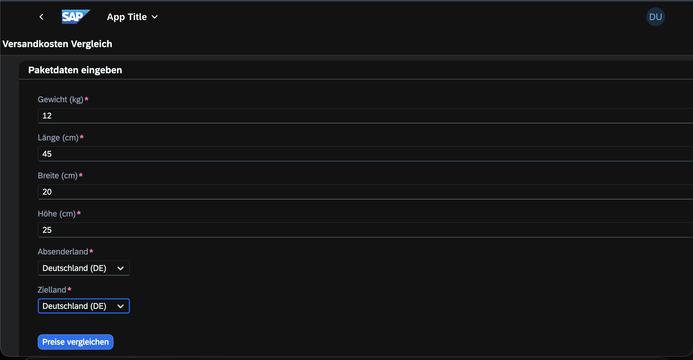
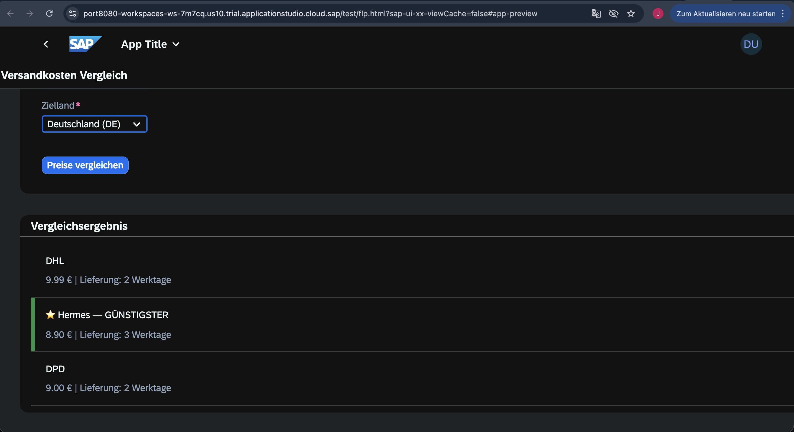
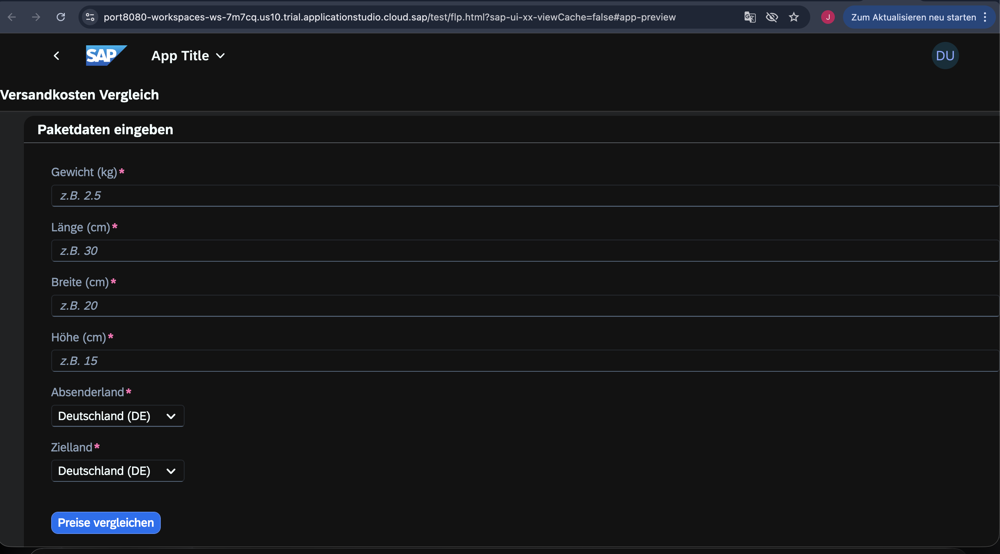

# Versandkosten-Vergleichsportal

Fullstack-Projekt das ich als Fachinformatiker entwickelt habe.
Die App vergleicht Versandkosten von **DHL, Hermes und DPD** in Echtzeit
und zeigt dem Nutzer automatisch den günstigsten Anbieter.

## Screenshots

### Eingabeformular


### Vergleichsergebnis


### App Übersicht


## Tech Stack

| Bereich | Technologie |
|--------|-------------|
| Backend | Java 21, Spring Boot 3.2 |
| Frontend | SAP Fiori / SAPUI5 Freestyle |
| API Docs | Swagger UI |
| Datenbank | H2 (lokal), MySQL (Produktion) |
| Build | Maven |
| IDE Backend | IntelliJ IDEA |
| IDE Frontend | SAP Business Application Studio |

## Was die App kann

- Nutzer gibt Gewicht, Maße und Zielland ein
- Backend berechnet Preise für DHL, Hermes und DPD
- Volumenwicht-Berechnung (Länge × Breite × Höhe / 5000)
- Günstigster Anbieter wird grün hervorgehoben mit ⭐
- Lieferdauer wird pro Anbieter angezeigt
- Fehlerbehandlung wenn ein Anbieter nicht erreichbar ist

## Projektstruktur

```
versandkosten-vergleich/
├── backend/
│   └── src/main/java/com/jurabek/versand/
│       ├── controller/
│       ├── service/
│       └── model/
└── frontend/
    └── webapp/
        ├── view/
        └── controller/
```

## API Endpoint
POST http://localhost:8080/api/v1/versand/vergleichen
**Request:**
```json
{
  "gewichtKg": 2.5,
  "laengeCm": 30,
  "breiteCm": 20,
  "hoeheCm": 15,
  "absenderland": "DE",
  "zielland": "DE"
}
```

**Response:**
```json
[
  { "anbieter": "DHL",    "preisEuro": 5.24, "lieferdauerWerktage": 2, "guenstigster": false },
  { "anbieter": "Hermes", "preisEuro": 4.63, "lieferdauerWerktage": 3, "guenstigster": true  },
  { "anbieter": "DPD",    "preisEuro": 5.20, "lieferdauerWerktage": 2, "guenstigster": false }
]
```

## Lokale Installation

**Backend:**
```bash
git clone https://github.com/JurabekNormatov/versandkosten-vergleich.git
cd versandkosten-vergleich/backend
./mvnw spring-boot:run
```

**Swagger UI:** `http://localhost:8080/swagger-ui.html`

**Frontend:** SAP Business Application Studio → `npm start`

## Über mich

Fachinformatiker (IHK Berlin 2025) mit Fokus auf Java Backend und SAP-Technologien.

GitHub: [JurabekNormatov](https://github.com/JurabekNormatov)
